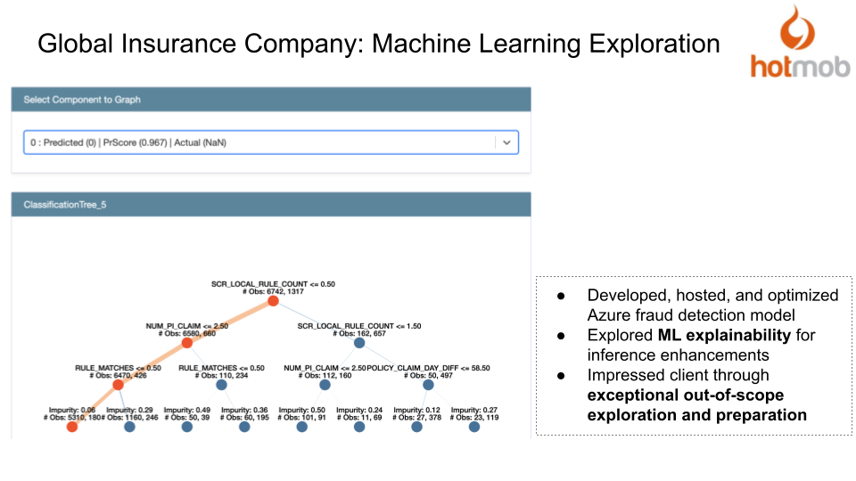

# Global Insurance Company Client Projects: Explainable ML

## Background

Other departments have found the machine learning (ML) models created by the Business Intelligence team to be "uninformative" for decision making and would like explanations to be provided.

## Objective

Add local feature importance to the ML models created by Azure Notebook + Designer + AutoML.

## Project Highlights

1. Created multiple solutions, some prioritizing keeping previously created models unchanged and some prioritizing efficiency but requiring updates to old models.

2. Better understood user pain points and proposed the Decision Tree Explainer, which better suited the needs of the users. Received commendations from the client.

3. Improved the DevOps process by introducing CICD and Dockerized applications.

## Results

Received positive user feedback and continue to collaborate to this day.