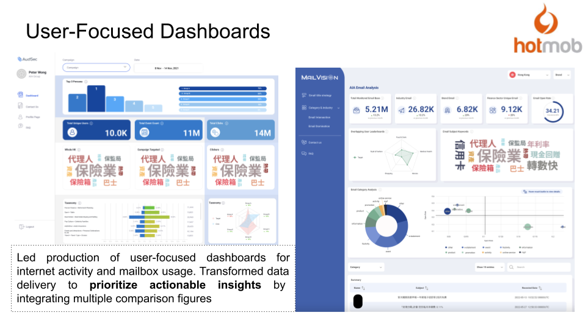

# Data Dashboard Development

## Background

I was tasked with revising an abandoned dashboard that receives critical reviews and develop a new dashboard, imbued with AI Technology.

## Project Highlights

1. Managed the development of both dashboards, both in Scrum Format

2. Revive abandoned dashboard by adding comparsison, such as Butterfly Charts and Radar Charts. Highlighting difference within audience groups and their changes overtime.

3. Developed a dashboard for monitoring mailboxes. Use AI technology to assist in censoring privacy information and generating email campaign with AI helping to boost performance.

## Results

Received positive user feedback and continue to collaborate to this day.