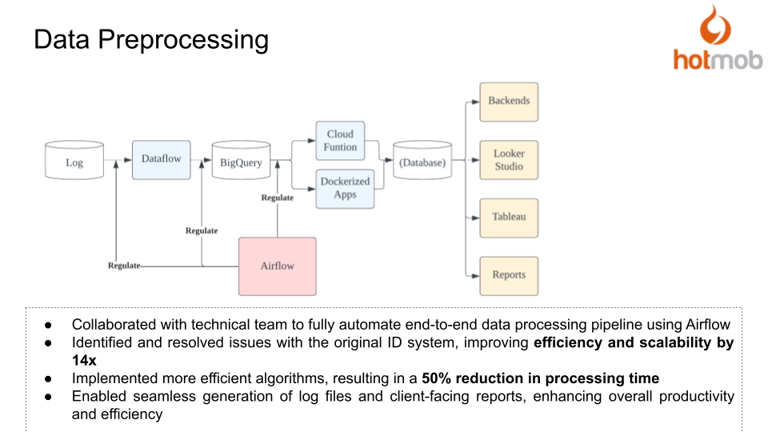

# DevOps/MLOps

## Objective

The objective is to automate processes in our internal pipeline and create a centralized interface to monitor data quality and ML models.

## Methodology Overview

1. Orchestrate the internal pipeline using Apache Airflow.

2. Set up email alerts for bugs and data delivery issues.

3. Store metrics generated by ML models in Bigquery and review them on a centralized dashboard on Looker Studio.

4. Achieve CICD through Gitlab.

## Additional Archievement

During the automation process, an error was identified in the Dataflow pipeline that led to a single user having up to 5 unique IDs. To address this, the pipeline was rewritten using a Connected Graph Algorithm that supports scalability up to 14 times.

## Results

The approach yielded the following results:

1. Elimination of up to 2 hours of manual triggering and monitoring with Airflow.

2. Centralized quality control over data.

3. An efficient algorithm improvement that sped up the ID matching by 2 times, allowing scalability and more accurate number reporting.