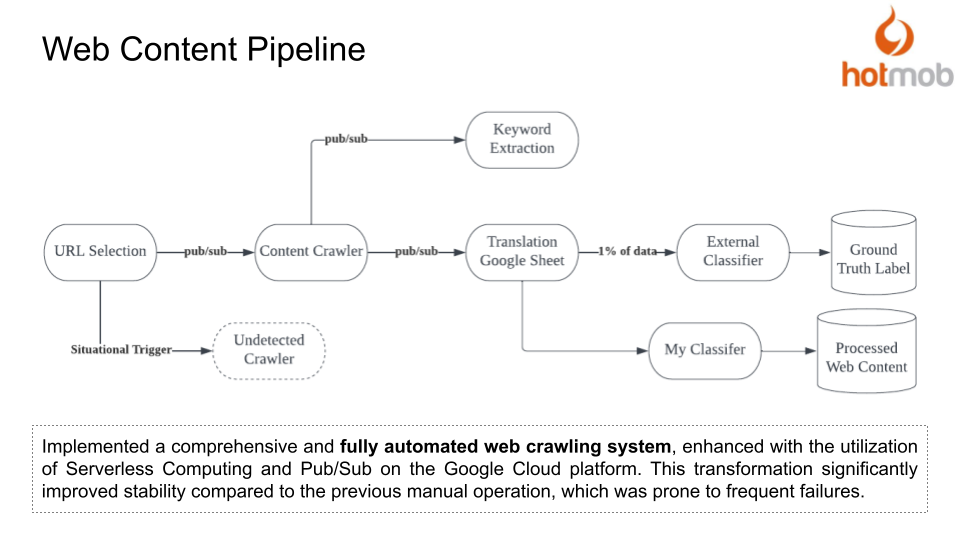
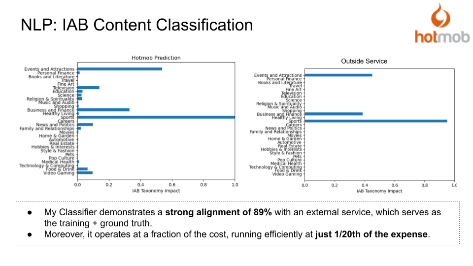

# Natural Language Processing: Internet Footprint

## Objective

1. Create an in-house software that could process large quantity of internet footprint and label them with IAB Taxonomy (Interest), Part-of-Speech, Keywords, and Sentiment.

2. Use this data to create services that recommend audiences based on similar behaviour or a specific interest

## Methodology Overview

### Process Web Data

1. Use crawler for general websites and undetected selenium for ones that block crawling. Made scalable using Google Cloud Function.

2. Created labels based on External NLP Serivces (Textrazor) and Active Learning.

3. Use GPT-2 Traditional Chinese released by CLIP, and finetune on HK web data.

4. Use the embedding from Finetuned GPT-2 to as input to train MLP Classifers and Generators. Update Monthly with new labels from Textrazor (Recently Switched to ChatGPT)

### Recommendation System

1. Compressed user footprint into a single vector, showing time disbution spent on each interest.

2. Use matrix factorization (WALS) to efficiently provide embedding for each user.

3. This allows our client to

	- Search for similar users
	- Search potential users by interests (i.e. Frequent Visitor of Soccer Field)

## Results

1. Boosting crawling capacity by 10x at 50% of the cost.

2. Reach a satisfying 89% Accuracy while only labelling ~2,000 Articles.

3. All Service Subscribers report improvement after using our service, and 70% has kept using our services.